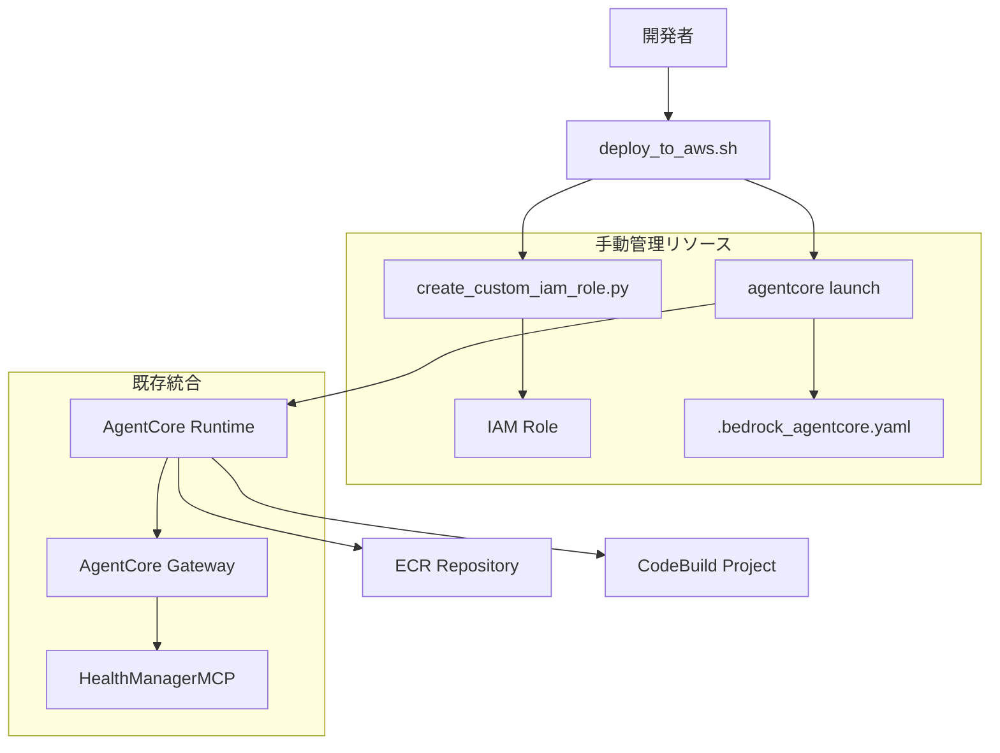
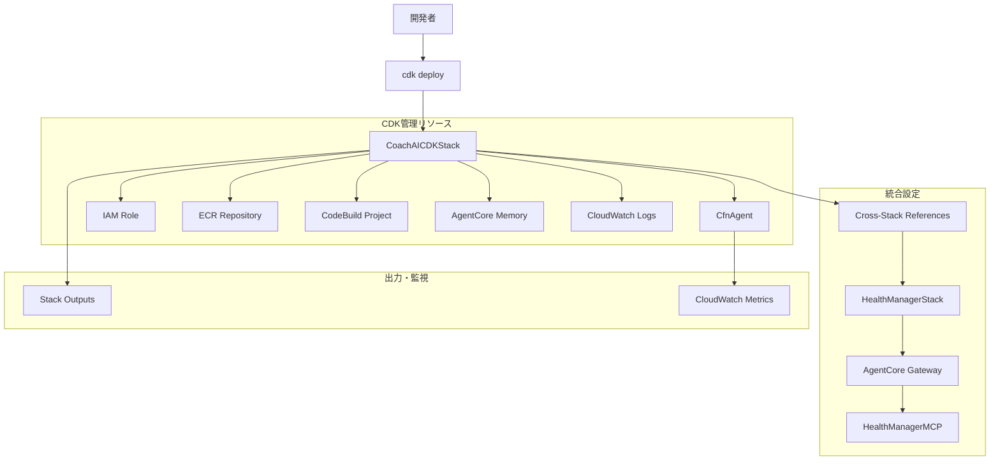

# 設計文書

## 概要

Healthmate-CoachAI サービスのデプロイメント方式を、現在の `agentcore launch` コマンドベースから AWS CDK (Python) ベースのInfrastructure as Code (IaC) アプローチに移行します。この移行により、デプロイメントの再現性、バージョン管理、および他のHealthmateサービスとの統合を向上させ、運用の自動化と標準化を実現します。

## アーキテクチャ

### 現在のアーキテクチャ（移行前）



### 新しいアーキテクチャ（移行後）



### デプロイメントフロー比較

#### 現在のフロー
1. 手動でIAMロール作成スクリプト実行
2. `agentcore configure` で設定ファイル生成
3. `agentcore launch` でデプロイ実行
4. 手動でテスト・検証

#### 新しいフロー
1. `cdk deploy` 一回実行
2. 自動的に全リソース作成・設定
3. 自動的にヘルスチェック実行
4. Stack Outputsで情報提供

## コンポーネントとインターフェース

### 主要コンポーネント

#### 1. CoachAICDKStack
- **責務**: メインのCDKスタック定義
- **技術**: AWS CDK (Python) + aws_cdk.aws_bedrockagentcore
- **機能**:
  - AgentCore Agent の作成・管理
  - IAM Role とポリシーの定義
  - ECR Repository の管理
  - CodeBuild Project の設定
  - 環境変数とシークレットの管理

#### 2. AgentConfiguration
- **責務**: エージェント設定の管理
- **技術**: CDK Constructs + Environment Variables
- **機能**:
  - 既存HealthManagerスタックとの統合
  - Gateway ID の動的取得
  - 環境別設定の管理

#### 3. CrossStackIntegration
- **責務**: 他のHealthmateサービスとの統合
- **技術**: CDK Cross-Stack References + CloudFormation Outputs
- **機能**:
  - HealthManagerスタックからの情報取得
  - Gateway設定の自動化
  - 認証情報の共有

#### 4. MigrationHelper
- **責務**: 既存設定からの移行支援
- **技術**: Python Scripts + YAML Parser
- **機能**:
  - .bedrock_agentcore.yaml の読み取り
  - 既存設定の変換
  - 移行前後の検証

### CDK リソース定義

#### CfnAgent リソース
```python
from aws_cdk import aws_bedrockagentcore as agentcore

agent = agentcore.CfnAgent(
    self, "HealthmateCoachAIAgent",
    agent_name="healthmate-coach-ai",
    
    # エージェント設定
    agent_configuration={
        "entrypoint": "healthmate_coach_ai/agent.py",
        "deployment_type": "container",
        "platform": "linux/arm64",
        "runtime_type": "python3.12"
    },
    
    # AWS設定
    aws_configuration={
        "execution_role": execution_role.role_arn,
        "region": self.region,
        "account": self.account,
        "ecr_repository": ecr_repository.repository_uri,
        "network_configuration": {
            "network_mode": "PUBLIC"
        }
    },
    
    # 環境変数
    environment_variables={
        "HEALTHMANAGER_GATEWAY_ID": gateway_id,
        "AWS_REGION": self.region,
        "LOG_LEVEL": "INFO"
    },
    
    # メモリ設定
    memory_configuration={
        "mode": "STM_ONLY",
        "event_expiry_days": 30
    }
)
```

#### IAM Role 定義
```python
from aws_cdk import aws_iam as iam

execution_role = iam.Role(
    self, "HealthmateCoachAIExecutionRole",
    role_name="Healthmate-CoachAI-AgentCore-Runtime-Role-CDK",
    assumed_by=iam.ServicePrincipal("bedrock-agentcore.amazonaws.com"),
    description="Healthmate-CoachAI AgentCore Runtime Role (CDK Managed)",
    
    inline_policies={
        "BedrockAgentCoreRuntimePolicy": iam.PolicyDocument(
            statements=[
                # Bedrock permissions
                iam.PolicyStatement(
                    effect=iam.Effect.ALLOW,
                    actions=[
                        "bedrock:InvokeModel",
                        "bedrock:InvokeModelWithResponseStream",
                        "bedrock:GetFoundationModel",
                        "bedrock:ListFoundationModels"
                    ],
                    resources=["*"]
                ),
                # AgentCore permissions
                iam.PolicyStatement(
                    effect=iam.Effect.ALLOW,
                    actions=["bedrock-agentcore:*"],
                    resources=["*"]
                ),
                # CloudWatch Logs permissions
                iam.PolicyStatement(
                    effect=iam.Effect.ALLOW,
                    actions=[
                        "logs:CreateLogGroup",
                        "logs:CreateLogStream", 
                        "logs:PutLogEvents",
                        "logs:DescribeLogGroups",
                        "logs:DescribeLogStreams"
                    ],
                    resources=["*"]
                ),
                # ECR permissions
                iam.PolicyStatement(
                    effect=iam.Effect.ALLOW,
                    actions=[
                        "ecr:GetAuthorizationToken",
                        "ecr:BatchCheckLayerAvailability",
                        "ecr:GetDownloadUrlForLayer",
                        "ecr:BatchGetImage"
                    ],
                    resources=["*"]
                ),
                # CloudFormation read permissions (for config)
                iam.PolicyStatement(
                    effect=iam.Effect.ALLOW,
                    actions=[
                        "cloudformation:DescribeStacks",
                        "cloudformation:DescribeStackResources"
                    ],
                    resources=[
                        f"arn:aws:cloudformation:{self.region}:{self.account}:stack/Healthmate-HealthManagerStack/*"
                    ]
                )
            ]
        )
    }
)
```

#### ECR Repository 管理
```python
from aws_cdk import aws_ecr as ecr

ecr_repository = ecr.Repository(
    self, "HealthmateCoachAIRepository",
    repository_name="healthmate-coach-ai",
    image_scan_on_push=True,
    lifecycle_rules=[
        ecr.LifecycleRule(
            description="Keep only 10 most recent images",
            max_image_count=10,
            rule_priority=1
        )
    ]
)
```

### 統合設定

#### Cross-Stack References
```python
# HealthManagerスタックからの情報取得
health_manager_stack = Stack.of(self).node.try_get_context("health_manager_stack_name") or "Healthmate-HealthManagerStack"

# Gateway ID の取得
gateway_id = Fn.import_value(f"{health_manager_stack}-GatewayId")

# Cognito設定の取得
user_pool_id = Fn.import_value(f"{health_manager_stack}-UserPoolId")
user_pool_client_id = Fn.import_value(f"{health_manager_stack}-UserPoolClientId")
```

#### 環境変数設定
```python
environment_variables = {
    "HEALTHMANAGER_GATEWAY_ID": gateway_id,
    "AWS_REGION": self.region,
    "HEALTH_STACK_NAME": health_manager_stack,
    "LOG_LEVEL": self.node.try_get_context("log_level") or "INFO",
    "AGENT_NAME": "healthmate-coach-ai"
}
```

## データモデル

### CDK設定データモデル

```python
from dataclasses import dataclass
from typing import Optional, Dict, Any

@dataclass
class CDKDeploymentConfig:
    """CDKデプロイメント設定"""
    stack_name: str = "Healthmate-CoachAI-Stack"
    agent_name: str = "healthmate-coach-ai"
    health_manager_stack_name: str = "Healthmate-HealthManagerStack"
    
    # エージェント設定
    entrypoint: str = "healthmate_coach_ai/agent.py"
    platform: str = "linux/arm64"
    deployment_type: str = "container"
    
    # AWS設定
    region: str = "us-west-2"
    log_level: str = "INFO"
    
    # メモリ設定
    memory_mode: str = "STM_ONLY"
    memory_expiry_days: int = 30
    
    # ECR設定
    ecr_repository_name: str = "healthmate-coach-ai"
    max_image_count: int = 10

@dataclass
class MigrationConfig:
    """移行設定"""
    source_config_file: str = ".bedrock_agentcore.yaml"
    backup_directory: str = ".migration_backup"
    preserve_existing_resources: bool = True
    cleanup_old_resources: bool = False
    
    # 移行オプション
    import_existing_ecr: bool = True
    migrate_memory_data: bool = True
    preserve_agent_id: bool = False  # 新しいAgent IDを生成

@dataclass
class CrossStackReferences:
    """クロススタック参照情報"""
    gateway_id: str
    user_pool_id: str
    user_pool_client_id: str
    gateway_endpoint: str
    
    @classmethod
    def from_stack_outputs(cls, stack_name: str) -> "CrossStackReferences":
        """CloudFormationスタック出力から情報を取得"""
        # CDK内では Fn.import_value を使用
        # テスト時は boto3 で実際の値を取得
        pass
```

### 設定ファイル構造

#### cdk.json
```json
{
  "app": "python app.py",
  "watch": {
    "include": [
      "**"
    ],
    "exclude": [
      "README.md",
      "cdk*.json",
      "requirements*.txt",
      "source.bat",
      "**/__pycache__",
      "**/*.pyc"
    ]
  },
  "context": {
    "health_manager_stack_name": "Healthmate-HealthManagerStack",
    "log_level": "INFO",
    "environment": "development"
  }
}
```

#### app.py (CDK App エントリーポイント)
```python
#!/usr/bin/env python3
import aws_cdk as cdk
from coach_ai_cdk.coach_ai_stack import CoachAICDKStack

app = cdk.App()

# 環境設定
env = cdk.Environment(
    account=app.node.try_get_context("account"),
    region=app.node.try_get_context("region") or "us-west-2"
)

# スタック作成
CoachAICDKStack(
    app, "Healthmate-CoachAI-Stack",
    env=env,
    description="Healthmate-CoachAI Service CDK Stack"
)

app.synth()
```

## 正確性プロパティ

*プロパティとは、システムの全ての有効な実行において真であるべき特性や動作のことです。本質的に、システムが何をすべきかについての形式的な記述です。プロパティは、人間が読める仕様と機械で検証可能な正確性保証の橋渡しとして機能します。*

### 受け入れ基準テスト前作業

<function_calls>
<invoke name="prework">
<parameter name="featureName">cdk-deployment-migration

### プロパティ反映

プリワーク分析を確認した結果、以下の冗長性を特定しました：

- **リソース作成関連**: プロパティ1.2（リソース作成）とプロパティ3.4（ECRリポジトリ管理）は同じリソース作成プロセスの一部のため、統合可能
- **設定管理関連**: プロパティ2.3（Gateway統合設定）とプロパティ3.5（環境変数設定）は同じ設定プロセスの一部のため、統合可能
- **エラーハンドリング関連**: プロパティ4.2（エラー情報提供）とプロパティ4.3（依存関係エラー）は類似のエラー処理パターンのため、統合可能
- **環境設定関連**: プロパティ5.1（環境設定調整）とプロパティ5.2（リージョン指定）は同じ環境設定メカニズムのため、統合可能

### 統合後の正確性プロパティ

**プロパティ 1: CDKリソース定義の完全性**
*任意の*CDKスタック定義に対して、必要なすべてのAWSリソース（Agent、IAM Role、ECR、CodeBuild等）が含まれている
**検証対象: 要件 1.1**

**プロパティ 2: 統合リソース作成**
*任意の*CDKデプロイ実行に対して、AgentCore Runtime、IAM Role、ECR Repository、CodeBuild Project が作成され、ECRリポジトリが適切に管理される
**検証対象: 要件 1.2, 3.4**

**プロパティ 3: 既存リソース競合回避**
*任意の*既存リソース状態に対して、CDKデプロイが名前衝突やリソース競合を起こさない
**検証対象: 要件 1.4**

**プロパティ 4: スタック出力提供**
*任意の*CDKデプロイ完了に対して、作成されたリソースの情報が適切なOutputsとして提供される
**検証対象: 要件 1.5**

**プロパティ 5: クロススタック情報取得**
*任意の*HealthManagerスタック状態に対して、Gateway統合情報が正しく取得される
**検証対象: 要件 2.1**

**プロパティ 6: MCP接続確立**
*任意の*環境変数設定に対して、エージェントが適切な設定でHealthManagerMCPに接続する
**検証対象: 要件 2.2**

**プロパティ 7: 統合設定自動化**
*任意の*Gateway設定に対して、必要な認証情報、エンドポイント情報、および環境変数が自動設定される
**検証対象: 要件 2.3, 3.5**

**プロパティ 8: 動的設定更新**
*任意の*外部依存関係変更に対して、CDKスタックが設定を適切に更新する
**検証対象: 要件 2.4**

**プロパティ 9: MCPプロトコル継続性**
*任意の*サービス間通信セッションに対して、既存のMCPプロトコルが正しく使用される
**検証対象: 要件 2.5**

**プロパティ 10: デプロイメント同等性**
*任意の*agentcore launch設定に対して、CDKが同等のContainer Deploymentを作成する
**検証対象: 要件 3.1**

**プロパティ 11: エージェント設定継続性**
*任意の*エージェント実行に対して、既存と同じentrypointとplatform設定が使用される
**検証対象: 要件 3.2**

**プロパティ 12: IAM権限同等性**
*任意の*IAMロール作成に対して、既存のカスタムロールと同等の権限が付与される
**検証対象: 要件 3.3**

**プロパティ 13: 自動ロールバック実行**
*任意の*CDKデプロイ失敗に対して、自動的にロールバックが実行される
**検証対象: 要件 4.1**

**プロパティ 14: 統合エラー情報提供**
*任意の*リソース作成エラーまたは依存関係問題に対して、詳細なエラー情報と適切なメッセージが提供される
**検証対象: 要件 4.2, 4.3**

**プロパティ 15: 権限不足明示**
*任意の*権限不足状況に対して、必要な権限が明確に示される
**検証対象: 要件 4.4**

**プロパティ 16: 失敗時クリーンアップ**
*任意の*部分的デプロイ失敗に対して、作成済みリソースが適切にクリーンアップされる
**検証対象: 要件 4.5**

**プロパティ 17: 統合環境設定管理**
*任意の*環境設定またはリージョン指定に対して、CDKスタックが適切に設定を調整し、指定されたリージョンにリソースを作成する
**検証対象: 要件 5.1, 5.2**

**プロパティ 18: カスタムスタック名使用**
*任意の*スタック名設定に対して、カスタムスタック名を使用してリソースが作成される
**検証対象: 要件 5.3**

**プロパティ 19: 依存関係解決**
*任意の*依存スタック名変更に対して、適切な依存関係が解決される
**検証対象: 要件 5.4**

**プロパティ 20: デバッグログ出力**
*任意の*デバッグモード設定に対して、詳細なログ出力が提供される
**検証対象: 要件 5.5**

**プロパティ 21: テストスクリプト互換性**
*任意の*CDKデプロイ完了に対して、既存のテストスクリプトが使用可能な状態が維持される
**検証対象: 要件 6.1**

**プロパティ 22: ステータス情報同等性**
*任意の*エージェントステータス確認要求に対して、既存のagentcore statusコマンドと同等の情報が提供される
**検証対象: 要件 6.2**

**プロパティ 23: CloudWatch統合**
*任意の*ログ設定に対して、適切なCloudWatchログ統合が提供される
**検証対象: 要件 6.3**

**プロパティ 24: メトリクス出力**
*任意の*メトリクス収集設定に対して、運用監視に必要なメトリクスが出力される
**検証対象: 要件 6.4**

**プロパティ 25: 自動ヘルスチェック**
*任意の*デプロイ検証実行に対して、自動的にヘルスチェックが実行される
**検証対象: 要件 6.5**

**プロパティ 26: 設定変換**
*任意の*.bedrock_agentcore.yaml設定に対して、移行スクリプトが正しく読み取り変換する
**検証対象: 要件 7.1**

**プロパティ 27: 既存リソース処理**
*任意の*既存リソース状態に対して、インポートまたは置き換えオプションが提供される
**検証対象: 要件 7.2**

**プロパティ 28: 移行バックアップ**
*任意の*移行プロセス開始に対して、現在のデプロイメント状態がバックアップされる
**検証対象: 要件 7.3**

**プロパティ 29: 移行完了推奨**
*任意の*移行完了に対して、古いagentcore launch設定の無効化が推奨される
**検証対象: 要件 7.4**

**プロパティ 30: ロールバック方法提供**
*任意の*ロールバック要求に対して、以前のagentcore launch設定への復帰方法が提供される
**検証対象: 要件 7.5**

## エラーハンドリング

### エラー分類と対応戦略

#### 1. CDKデプロイメントエラー
- **スタック作成失敗**: 自動ロールバックとエラー詳細の提供
- **リソース競合**: 既存リソース検出と代替名の提案
- **権限不足**: 必要な権限の明確な表示と設定手順の提供
- **依存関係エラー**: 依存スタックの状態確認と修正手順の提示

#### 2. 移行プロセスエラー
- **設定ファイル読み取りエラー**: ファイル形式の検証と修正提案
- **既存リソース検出エラー**: 手動確認手順の提供
- **バックアップ失敗**: 代替バックアップ方法の提示
- **変換エラー**: 設定項目の個別確認と手動設定オプション

#### 3. 統合エラー
- **クロススタック参照エラー**: 依存スタックの存在確認と修正手順
- **Gateway情報取得エラー**: 手動設定オプションの提供
- **環境変数設定エラー**: デフォルト値の使用と警告表示

#### 4. 検証エラー
- **ヘルスチェック失敗**: 詳細な診断情報と修正手順の提供
- **テスト互換性エラー**: 既存テストの更新手順の提示
- **メトリクス設定エラー**: 代替監視方法の提案

### エラー回復メカニズム

```python
@dataclass
class CDKErrorRecoveryConfig:
    max_retries: int = 3
    rollback_on_failure: bool = True
    preserve_partial_resources: bool = False
    backup_before_migration: bool = True
    
class CDKErrorHandler:
    def handle_deployment_error(self, error: CDKDeploymentError) -> RecoveryAction
    def handle_migration_error(self, error: MigrationError) -> RecoveryAction
    def handle_integration_error(self, error: IntegrationError) -> RecoveryAction
    def handle_validation_error(self, error: ValidationError) -> UserMessage
```

## テスト戦略

### デュアルテストアプローチ

本システムでは、ユニットテストとプロパティベーステストの両方を実装し、包括的なテストカバレッジを実現します。

#### ユニットテスト
- **CDKスタック定義の検証**: 個別リソースの設定確認
- **移行スクリプトの動作確認**: 特定の設定ファイルでの変換テスト
- **エラーハンドリングの検証**: 特定のエラー条件での動作確認
- **統合ポイントのテスト**: クロススタック参照の動作確認

#### プロパティベーステスト
- **全設定パターンに対する正確性の検証**: ランダムな設定での動作確認
- **リソース作成の一貫性**: 様々な環境での同等性確認
- **エラー処理の網羅性**: 多様なエラー条件での適切な処理確認
- **移行プロセスの堅牢性**: 様々な既存設定での移行成功確認

### プロパティベーステストライブラリ

**選択ライブラリ**: Hypothesis (Python)
- 理由: Pythonエコシステムでの標準的なプロパティベーステストライブラリ
- CDK Pythonコードとの統合が容易
- AWS リソース設定の複雑なデータ生成に対応

### テスト設定要件

- **最小実行回数**: 各プロパティテストは100回以上実行
- **タグ付け**: 各プロパティベーステストに設計文書の対応プロパティを明記
- **タグ形式**: `**Feature: cdk-deployment-migration, Property {number}: {property_text}**`

### テスト実装例

```python
from hypothesis import given, strategies as st
import pytest
from aws_cdk import App, Stack
from coach_ai_cdk.coach_ai_stack import CoachAICDKStack

class TestCDKDeploymentProperties:
    
    @given(st.text(min_size=1, max_size=50))
    def test_property_1_cdk_resource_definition_completeness(self, stack_name):
        """**Feature: cdk-deployment-migration, Property 1: CDKリソース定義の完全性**"""
        app = App()
        stack = CoachAICDKStack(app, stack_name)
        
        # 必要なリソースが定義されているかを確認
        template = app.synth().get_stack_by_name(stack_name).template
        
        assert "AWS::BedrockAgentCore::Agent" in str(template)
        assert "AWS::IAM::Role" in str(template)
        assert "AWS::ECR::Repository" in str(template)
        assert "AWS::CodeBuild::Project" in str(template)
    
    @given(st.dictionaries(
        st.text(min_size=1, max_size=20),
        st.text(min_size=1, max_size=50),
        min_size=1, max_size=5
    ))
    def test_property_17_integrated_environment_configuration(self, env_config):
        """**Feature: cdk-deployment-migration, Property 17: 統合環境設定管理**"""
        app = App()
        
        # 環境設定を適用
        for key, value in env_config.items():
            app.node.set_context(key, value)
        
        stack = CoachAICDKStack(app, "test-stack")
        
        # 設定が適切に反映されているかを確認
        template = app.synth().get_stack_by_name("test-stack").template
        assert template is not None
        
        # リージョン設定の確認
        if "region" in env_config:
            # リージョン固有のリソース設定を確認
            pass
```

### テスト環境とモック戦略

#### 統合テスト環境
- **実際のCDKデプロイ**: テスト用AWSアカウントでの実際のデプロイ
- **モックAWSサービス**: moto ライブラリを使用した単体テスト
- **CloudFormation テンプレート検証**: CDK synthで生成されるテンプレートの検証

#### モック使用指針
- **AWS API呼び出し**: boto3 呼び出しのモック
- **外部依存関係**: HealthManagerスタックの出力のモック
- **ファイルシステム**: 設定ファイル読み取りのモック

ただし、プロパティベーステストでは可能な限り実際のCDK機能を使用し、モックは最小限に留めます。

## 実装計画

### フェーズ1: 基本CDKスタック作成
1. CDKプロジェクト構造の作成
2. 基本的なCfnAgentリソースの定義
3. IAMロールとポリシーの実装
4. ECRリポジトリの管理

### フェーズ2: 統合機能実装
1. クロススタック参照の実装
2. 環境変数とシークレット管理
3. Gateway統合の自動化
4. CloudWatchログ統合

### フェーズ3: 移行機能実装
1. 既存設定の読み取り・変換
2. 移行スクリプトの作成
3. バックアップ・復旧機能
4. 既存リソースの処理

### フェーズ4: 検証・監視機能
1. 自動ヘルスチェック
2. メトリクス収集設定
3. エラーハンドリングの強化
4. テスト互換性の確保

### デプロイメント戦略

#### 段階的移行アプローチ
1. **並行運用期間**: 既存のagentcore launchとCDKの両方を維持
2. **検証期間**: CDKデプロイメントの動作確認
3. **切り替え期間**: CDKを主要デプロイ方法に変更
4. **クリーンアップ期間**: 古いagentcore launch設定の削除

#### ロールバック計画
- CDK移行前の完全バックアップ
- 既存agentcore launch設定の保持
- 迅速な復旧手順の文書化
- 自動ロールバックスクリプトの提供