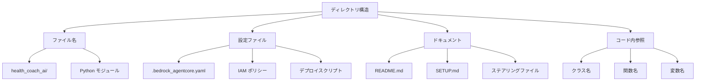

# 設計書

## 概要

HealthCoachAI サービスを Healthmate-CoachAI に名前変更するための包括的な設計です。この変更により、Healthmate プロダクトの命名規則との一貫性を確保し、ブランディングを統一します。

## アーキテクチャ

### 変更対象コンポーネント



### 名前変更マッピング

| 変更前 | 変更後 | 対象 |
|--------|--------|------|
| HealthCoachAI | Healthmate-CoachAI | サービス名、ディレクトリ名 |
| health_coach_ai | healthmate_coach_ai | Python パッケージ名 |
| HealthCoachAI-AgentCore-Runtime-Role | Healthmate-CoachAI-AgentCore-Runtime-Role | IAM ロール名 |
| health_coach_ai | healthmate_coach_ai | AgentCore エージェント名 |

## コンポーネントと インターフェース

### ファイルシステム変更

#### ディレクトリ構造
```
変更前:
HealthCoachAI/
├── health_coach_ai/
│   ├── __init__.py
│   └── agent.py

変更後:
Healthmate-CoachAI/
├── healthmate_coach_ai/
│   ├── __init__.py
│   └── agent.py
```

#### 設定ファイル変更
- `.bedrock_agentcore.yaml`: エージェント名の更新
- `create_custom_iam_role.py`: IAM ロール名の更新
- `deploy_to_aws.sh`: 各種参照の更新

### AWS リソース変更

#### IAM ロール
```python
# 変更前
ROLE_NAME = "HealthCoachAI-AgentCore-Runtime-Role"

# 変更後  
ROLE_NAME = "Healthmate-CoachAI-AgentCore-Runtime-Role"
```

#### AgentCore エージェント
```yaml
# 変更前
agents:
  health_coach_ai:
    bedrock_agentcore:
      memory:
        memory_id: "health_coach_ai_mem-yxqD6w75pO"

# 変更後
agents:
  healthmate_coach_ai:
    bedrock_agentcore:
      memory:
        memory_id: "healthmate_coach_ai_mem-yxqD6w75pO"
```

## データモデル

### 設定データ構造

```python
class ServiceConfig:
    """サービス設定データモデル"""
    old_service_name: str = "HealthCoachAI"
    new_service_name: str = "Healthmate-CoachAI"
    old_package_name: str = "health_coach_ai"
    new_package_name: str = "healthmate_coach_ai"
    old_iam_role: str = "HealthCoachAI-AgentCore-Runtime-Role"
    new_iam_role: str = "Healthmate-CoachAI-AgentCore-Runtime-Role"
```

### ファイル変更マッピング

```python
class FileMapping:
    """ファイル変更マッピング"""
    directory_changes: Dict[str, str] = {
        "health_coach_ai/": "healthmate_coach_ai/"
    }
    
    content_replacements: Dict[str, str] = {
        "HealthCoachAI": "Healthmate-CoachAI",
        "health_coach_ai": "healthmate_coach_ai",
        "HealthCoachAI-AgentCore-Runtime-Role": "Healthmate-CoachAI-AgentCore-Runtime-Role"
    }
```

## 正確性プロパティ

*プロパティとは、システムの全ての有効な実行において真であるべき特性や動作のことです。プロパティは、人間が読める仕様と機械で検証可能な正確性保証の橋渡しをします。*

### プロパティ 1: ファイル名変更の一貫性
*任意の* 変更対象ファイルについて、古いサービス名を含むファイル名は新しいサービス名に置き換えられる
**検証: 要件 1.1**

### プロパティ 2: 設定ファイル内容の一貫性  
*任意の* 設定ファイルについて、古いサービス名への参照は全て新しいサービス名に置き換えられる
**検証: 要件 1.2**

### プロパティ 3: AWS リソース名の一貫性
*任意の* AWS リソースについて、古い命名規則は新しい healthmate-coach-ai プレフィックスに置き換えられる
**検証: 要件 1.3**

### プロパティ 4: ドキュメント更新の一貫性
*任意の* ドキュメントファイルについて、古いサービス名への言及は全て新しいサービス名に置き換えられる
**検証: 要件 1.4**

### プロパティ 5: コード参照の一貫性
*任意の* Python ファイルについて、古いパッケージ名やクラス名は新しい名前空間に置き換えられる
**検証: 要件 1.5**

### プロパティ 6: デプロイメント安全性
*任意の* 名前変更操作について、既存のデプロイメントが破壊されることなく実行される
**検証: 要件 2.1**

### プロパティ 7: クリーンアップ手順提供
*任意の* 新しい設定でのデプロイについて、古いリソースのクリーンアップ手順が提供される
**検証: 要件 2.2**

### プロパティ 8: 検証方法提供
*任意の* 移行ステップについて、そのステップの検証方法が提供される
**検証: 要件 2.3**

### プロパティ 9: ロールバック手順提供
*任意の* 名前変更プロセスについて、元の状態に戻すロールバック手順が提供される
**検証: 要件 2.4**

### プロパティ 10: サービス間参照更新の一貫性
*任意の* 他サービスからの参照について、新しいサービス名が正しく使用される
**検証: 要件 3.1, 3.2, 3.3, 3.4**

### プロパティ 11: テスト実行の一貫性
*任意の* テストスクリプトについて、新しいサービス名で正常に動作する
**検証: 要件 4.1, 4.2, 4.3, 4.4**

## エラーハンドリング

### ファイル操作エラー
- **権限エラー**: ファイル変更権限の確認とエラーメッセージ
- **ファイル不存在**: 変更対象ファイルの存在確認
- **バックアップ失敗**: 変更前のバックアップ作成確認

### AWS リソースエラー
- **IAM ロール競合**: 既存ロール名との競合チェック
- **AgentCore デプロイエラー**: 新しい名前でのデプロイ失敗時の処理
- **リソース削除エラー**: 古いリソースの削除失敗時の処理

### 統合エラー
- **他サービス参照エラー**: 他サービスからの参照更新失敗
- **設定不整合**: 設定ファイル間の不整合検出

## テスト戦略

### 単体テスト
- ファイル名変更機能のテスト
- 設定ファイル更新機能のテスト
- AWS リソース名変更のテスト

### プロパティベーステスト
- **テストライブラリ**: pytest + hypothesis
- **最小実行回数**: 100回の反復実行
- **プロパティタグ**: 各テストに対応する正確性プロパティを明記

プロパティベーステストの要件:
- 各正確性プロパティは単一のプロパティベーステストで実装される
- 各テストは対応する設計書のプロパティ番号でタグ付けされる
- テストは '**Feature: service-rename, Property {number}: {property_text}**' 形式でコメント

### 統合テスト
- 完全な名前変更プロセスのエンドツーエンドテスト
- 他サービスとの統合ポイントテスト
- デプロイメント検証テスト

### 手動テスト
- デプロイ前後の動作確認
- UI からの呼び出しテスト
- ログ出力の確認